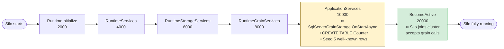
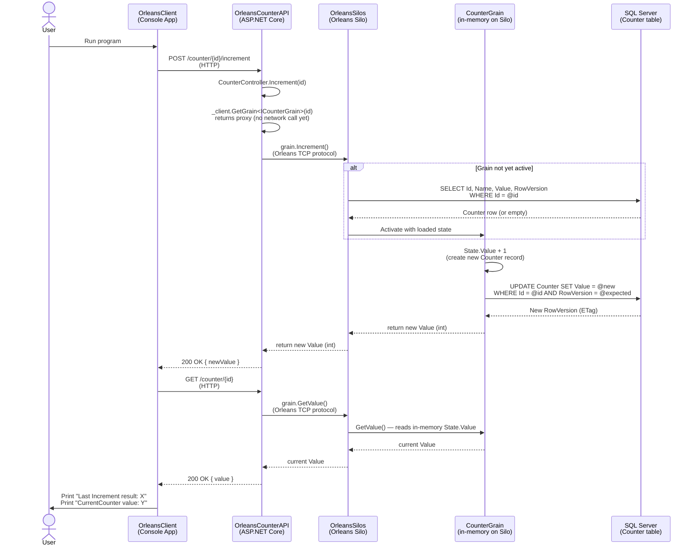
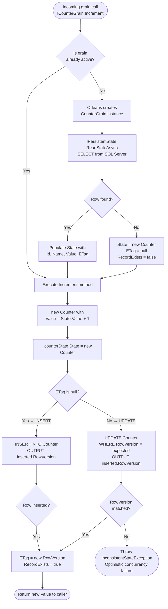
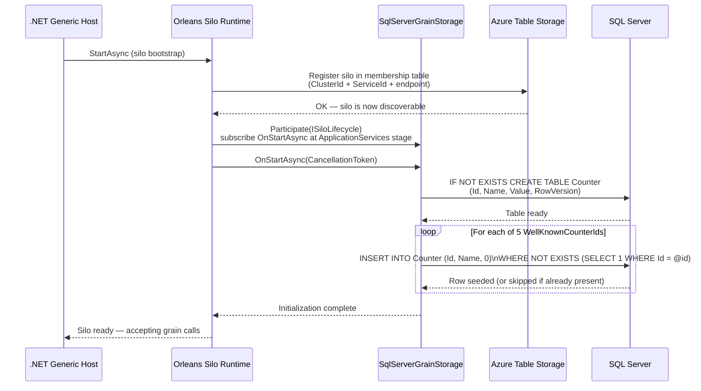
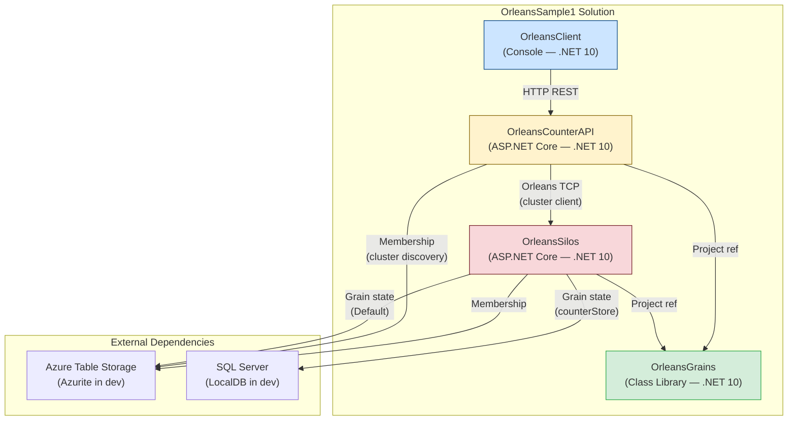

# OrleansSample1 — Architecture & Design Documentation

## Table of Contents

1. [What is Microsoft Orleans?](#what-is-microsoft-orleans)
2. [Core Orleans Concepts](#core-orleans-concepts)
   - [Grain](#grain)
   - [Grain Interface](#grain-interface)
   - [Silo](#silo)
   - [Cluster](#cluster)
   - [Clustering Provider](#clustering-provider)
   - [Grain Storage / Persistent State](#grain-storage--persistent-state)
   - [Orleans Client](#orleans-client)
   - [Grain Lifecycle & Activation](#grain-lifecycle--activation)
   - [Silo Lifecycle & ILifecycleParticipant](#silo-lifecycle--ilifecycleparticipant)
   - [Serialization](#serialization)
3. [Solution Architecture Overview](#solution-architecture-overview)
4. [Project Details](#project-details)
   - [OrleansGrains](#orleansgrains)
   - [OrleansSilos](#orleanssilos)
   - [OrleansCounterAPI](#orleanscounterapi)
   - [OrleansClient](#orleansclient)
5. [Data Flow Diagrams](#data-flow-diagrams)
   - [End-to-End Request Flow](#end-to-end-request-flow)
   - [Grain Activation & Persistence Flow](#grain-activation--persistence-flow)
   - [Silo Startup & Storage Initialization](#silo-startup--storage-initialization)
   - [Project Dependency Graph](#project-dependency-graph)

---

## What is Microsoft Orleans?

**Microsoft Orleans** is an open-source framework for building distributed, scalable, cloud-native applications on .NET. It implements the **Virtual Actor Model**, where the unit of computation is called a **Grain**.

Key benefits that drove the design of this solution:

| Benefit | How it applies here |
|---|---|
| **Simplified concurrency** | Each grain processes one request at a time — no locks needed inside `CounterGrain` |
| **Transparent distribution** | Grains live on any silo in the cluster; callers never manage where |
| **Automatic lifecycle** | Orleans activates grains on demand and deactivates them when idle |
| **Built-in persistence** | `IPersistentState<T>` persists grain state without manual ORM code |
| **Horizontal scalability** | Add more silos to the cluster and Orleans balances grain activations automatically |

Orleans targets the challenge of building stateful, distributed services without writing complex threading, remoting, or distributed coordination code by hand.

---

## Core Orleans Concepts

### Grain

A **Grain** is the fundamental building block in Orleans — it is the virtual actor. Think of it as a lightweight object that:

- Has a **stable identity** (its *key* — a `Guid`, `long`, `string`, or compound value).
- Holds **in-memory state** while active.
- Processes **one message at a time** (single-threaded turn-based execution).
- Is **virtual** — it always logically exists, even if it is not currently loaded in memory. Orleans activates it automatically on first use.

**In this solution:** `CounterGrain` is a grain identified by a `Guid`. Any number of independent counters can exist simply by using different GUIDs — no factory or registration is needed.

---

### Grain Interface

A **Grain Interface** is the public contract of a grain. It must:

- Extend one of the identity marker interfaces (`IGrainWithGuidKey`, `IGrainWithIntegerKey`, etc.).
- Declare only `Task`- or `ValueTask`-returning methods (every grain call is asynchronous and potentially remote).

Clients and other grains call grains **only through their interface**, never through a concrete type. This is the Orleans equivalent of programming to an abstraction.

**In this solution:** `ICounterGrain : IGrainWithGuidKey` declares the two operations a counter exposes — `Increment()` and `GetValue()`.

---

### Silo

A **Silo** is the host process that runs grains. It:

- Manages grain activation and deactivation.
- Routes incoming calls to the correct grain instance.
- Participates in cluster membership.
- Owns the storage providers that grains read and write.

Multiple silos join together to form a **Cluster**. Each silo typically runs in its own process (or container). Silos communicate with each other over TCP.

**In this solution:** `OrleansSilos` is the silo host. It is an ASP.NET Core application that hosts the Orleans runtime alongside optional HTTP endpoints (mapped via `MapControllers`, though no controllers are defined in this project — the silo's job is grain hosting).

---

### Cluster

A **Cluster** is a logical group of silos that collectively host the same set of grains. A cluster is identified by two settings:

| Setting | Purpose |
|---|---|
| `ClusterId` | Identifies the cluster — silos with the same `ClusterId` join the same cluster. |
| `ServiceId` | Identifies the logical service — used to namespace grain state in storage so that state persists across cluster restarts even if the `ClusterId` changes. |

**In this solution:** Both `OrleansSilos` and `OrleansCounterAPI` are configured with `ClusterId = "MyOrleansCluster"` and `ServiceId = "MyOrleansService"` (from `appsettings.json`).

---

### Clustering Provider

The **Clustering Provider** is the membership backend that silos use to discover each other and agree on who is alive. Common providers include Azure Table Storage, ZooKeeper, Consul, and ADO.NET.

**In this solution:** **Azure Table Storage** (`UseDevelopmentStorage=true` in development, pointing at the Azurite emulator) is the clustering backend. Both the silo and the client read the same membership table to find the cluster.

---

### Grain Storage / Persistent State

**Grain Storage** is the pluggable backend where grain state is saved and loaded. It is accessed through `IPersistentState<T>`, which exposes:

| Member | Description |
|---|---|
| `State` | The current in-memory value of the state object |
| `ETag` | An optimistic-concurrency token set by the storage provider |
| `RecordExists` | Whether a record was found in the backend |
| `ReadStateAsync()` | Load state from the backend into `State` |
| `WriteStateAsync()` | Persist `State` to the backend |
| `ClearStateAsync()` | Delete the record from the backend |

A grain declares its state dependency via a constructor parameter decorated with `[PersistentState("stateName", "storageName")]`. The two string arguments identify:
- `stateName` — a logical name for this piece of state (used by some providers as a column or key segment).
- `storageName` — the **named storage provider** registered on the silo that handles reads and writes.

**In this solution:** Two storage providers are registered:

| Name | Backend | Used by |
|---|---|---|
| `"Default"` | Azure Table Storage | Default fallback for any grain that doesn't specify a provider |
| `"counterStore"` | Custom SQL Server | `CounterGrain` explicitly requests this via `[PersistentState("counter", "counterStore")]` |

---

### Orleans Client

An **Orleans Client** connects to a cluster from outside the silo boundary. It does not host grains — it only sends messages to them. The client:

- Uses the same clustering provider as the silos to discover the cluster.
- Gets grain references via `IClusterClient.GetGrain<TInterface>(key)`.
- Calls grain methods through those references exactly like any other caller.

**In this solution:** `OrleansCounterAPI` is configured with `UseOrleansClient(...)`. It acts as an HTTP façade: HTTP requests arrive, are translated into grain calls, and the results are returned as HTTP responses.

---

### Grain Lifecycle & Activation

Orleans manages grain lifetime automatically:

1. **On first call** — Orleans creates a grain activation on a silo, loads its persistent state, and processes the call.
2. **While active** — subsequent calls go directly to the in-memory instance.
3. **On idle** — after a configurable timeout with no calls, Orleans deactivates the grain and releases its memory. State is already saved in storage.
4. **On next call** — the grain is re-activated and state is reloaded from storage.

This means callers **never need to know** whether a grain is currently in memory.

---

### Silo Lifecycle & ILifecycleParticipant

#### What is it?

The **Orleans Silo Lifecycle** is an ordered, stage-based startup and shutdown pipeline. Any component — storage providers, background services, custom infrastructure — can hook into this pipeline by implementing:

```csharp
ILifecycleParticipant<ISiloLifecycle>
```

The interface has exactly one method:

```csharp
void Participate(ISiloLifecycle observer);
```

`ISiloLifecycle` is an observable pipeline. Inside `Participate`, the component calls `observer.Subscribe(name, stage, onStart, onStop)` to register an asynchronous callback at a specific **stage number**. Orleans collects all subscriptions from all registered participants and then executes them in strict stage order during startup (ascending) and in reverse order during graceful shutdown (descending).

#### Why is it important?

Without a lifecycle mechanism, there is no safe, guaranteed ordering between when a component is constructed and when it is actually ready to serve requests. Consider what happens to `SqlServerGrainStorage` specifically:

| Scenario | Without `ILifecycleParticipant` | With `ILifecycleParticipant` |
|---|---|---|
| Table creation | Must happen lazily inside `ReadStateAsync` or `WriteStateAsync` — every call needs a guard | Happens once at startup, before any grain activates |
| Seed data insertion | Must be checked on every grain activation | Inserted once at startup, idempotently |
| Race condition risk | Two grains activating simultaneously could both attempt `CREATE TABLE` | Zero risk — silo accepts no grain calls until startup completes |
| Error visibility | A missing table appears as a grain method failure deep in a call chain | A missing database appears immediately at silo startup with a clear error |
| Graceful shutdown | No opportunity to flush pending writes or close connection pools | An `onStop` callback can drain work and clean up resources |

In short: **`ILifecycleParticipant<ISiloLifecycle>` is the correct, idiomatic way for any Orleans infrastructure component to perform initialization and cleanup**. It transforms fragile lazy-init patterns into explicit, ordered, testable startup steps.

#### The Lifecycle Stages

Orleans defines a set of integer stage constants in `ServiceLifecycleStage`. Stages run in **ascending order at startup** and **descending order at shutdown**:

| Stage constant | Value | Description |
|---|---|---|
| `First` | `int.MinValue` | Very first thing — before anything else |
| `RuntimeInitialize` | `2000` | Core Orleans runtime primitives |
| `RuntimeServices` | `4000` | Internal Orleans services (messaging, reminders) |
| `RuntimeStorageServices` | `6000` | Built-in storage runtime services |
| `RuntimeGrainServices` | `8000` | Grain directory, placement, activation catalog |
| `ApplicationServices` | `10000` | **Custom application-level services** ← `SqlServerGrainStorage` subscribes here |
| `BecomeActive` | `20000` | Silo joins the cluster and starts accepting grain calls |
| `Last` | `int.MaxValue` | Very last thing |

`SqlServerGrainStorage` subscribes at `ApplicationServices` (10 000). This means:
- The entire Orleans runtime is fully initialized (`RuntimeGrainServices` = 8 000 is done).
- The SQL table is created and seeded **before** `BecomeActive` (20 000) — the silo does not accept a single grain call until this completes successfully.
- If the database is unreachable, the silo fails to start cleanly rather than silently accepting requests that will all fail.



#### How it works in this solution

**Step 1 — Implementing the interface**

`SqlServerGrainStorage` implements `ILifecycleParticipant<ISiloLifecycle>` and provides the `Participate` method:

```csharp
public void Participate(ISiloLifecycle observer) =>
    observer.Subscribe(
        nameof(SqlServerGrainStorage),          // name — used in logs and diagnostics
        ServiceLifecycleStage.ApplicationServices,  // stage 10 000
        OnStartAsync);                          // async callback to invoke at this stage
```

- The **name** is purely for observability — it appears in startup logs so you can trace which participant ran at which stage.
- The **stage** controls *when* the callback runs relative to all other participants.
- The **`onStart` delegate** (`OnStartAsync`) is the async method that actually creates the table and seeds data.
- No `onStop` delegate is passed here — the SQL connection is opened per-operation (not pooled at the class level), so there is nothing to clean up at shutdown.

**Step 2 — `OnStartAsync` does the work**

```csharp
private async Task OnStartAsync(CancellationToken ct)
{
    await using var connection = new SqlConnection(_options.ConnectionString);
    await connection.OpenAsync(ct);
    await using var createCmd = new SqlCommand(CreateTableSql, connection);
    await createCmd.ExecuteNonQueryAsync(ct);   // CREATE TABLE IF NOT EXISTS
    await SeedCountersAsync(connection, ct);    // INSERT 5 rows WHERE NOT EXISTS
    _logger.LogInformation("SqlServerGrainStorage '{Name}' initialized.", _name);
}
```

The `CancellationToken ct` is the silo's startup cancellation token — if the host is shut down mid-startup (e.g. Ctrl+C), the token is cancelled and the in-progress SQL operations are aborted cleanly.

**Step 3 — Registering with DI so Orleans finds it**

Orleans discovers lifecycle participants by scanning the DI container for all registrations of `ILifecycleParticipant<ISiloLifecycle>`. The extension method in `SqlServerGrainStorageExtensions` performs this registration:

```csharp
builder.Services.AddSingleton<ILifecycleParticipant<ISiloLifecycle>>(sp =>
    (ILifecycleParticipant<ISiloLifecycle>)sp.GetRequiredKeyedService<IGrainStorage>(name));
```

This re-exposes the **same singleton instance** of `SqlServerGrainStorage` under the `ILifecycleParticipant<ISiloLifecycle>` service type. Orleans calls `Participate` on it once during silo bootstrap, gathers the subscription, and then executes `OnStartAsync` at the correct stage.

> **Key insight:** A single `SqlServerGrainStorage` instance serves **two roles** simultaneously — it is both the `IGrainStorage` that grains call for reads and writes, and the `ILifecycleParticipant<ISiloLifecycle>` that initializes the database at startup. The keyed singleton pattern in the extension method ensures both roles share the same object without constructing two instances.

#### What would break without it

If `SqlServerGrainStorage` did not implement `ILifecycleParticipant<ISiloLifecycle>`:

1. `OnStartAsync` would never be called — no table, no seed data.
2. The first `CounterGrain` to activate would call `ReadStateAsync`, which would execute `SELECT ... FROM Counter` against a table that does not exist → **SQL exception, grain activation fails**.
3. The developer would be forced to add lazy, thread-unsafe `IF NOT EXISTS` guards inside every `ReadStateAsync` and `WriteStateAsync` call — adding latency to every grain operation and introducing race conditions under concurrent activation.
4. There would be no opportunity to fail fast at startup: the application would appear healthy until the first actual grain call, making the failure much harder to diagnose.

---

### Serialization

Orleans serializes grain method arguments, return values, and persistent state when transmitting them across the network or storing them. Orleans uses its own high-performance serializer, driven by source generation.

To make a type serializable by Orleans, decorate it with:

| Attribute | Meaning |
|---|---|
| `[GenerateSerializer]` | Instructs the Orleans SDK source generator to emit a serializer for this type |
| `[Id(n)]` | Assigns a stable numeric ID to each property so the schema is wire-compatible across versions |
| `[Immutable]` | Tells Orleans the object will not be mutated after creation — enables a zero-copy optimization for same-silo calls |

**In this solution:** The `Counter` record is decorated with all three, making it safe to transmit between silos and to serialize into storage.

---

## Solution Architecture Overview

The solution is composed of four projects arranged in two physical tiers:

```
┌──────────────────────────────────────────────────────────────────┐
│  Client Tier                                                     │
│                                                                  │
│   OrleansClient (Console)  ──HTTP──▶  OrleansCounterAPI (ASP.NET)│
│                                              │                   │
│                                     Orleans Client SDK           │
│                                              │                   │
└──────────────────────────────────────────────┼───────────────────┘
                                               │ Orleans Protocol (TCP)
┌──────────────────────────────────────────────┼───────────────────┐
│  Silo Tier                                   │                   │
│                                              ▼                   │
│                                    OrleansSilos (ASP.NET)        │
│                                    ┌──────────────────────┐      │
│                                    │  CounterGrain        │      │
│                                    │  (in-memory state)   │      │
│                                    └──────────┬───────────┘      │
│                                               │                  │
│                          ┌────────────────────┼────────────┐     │
│                          ▼                    ▼            ▼     │
│                   Azure Table          SQL Server     Azure Table │
│                   (clustering)         (grain state)  (default    │
│                                                        storage)   │
└──────────────────────────────────────────────────────────────────┘

                  ──────────── OrleansGrains (shared library) ────────────
                      (referenced by both OrleansSilos and OrleansCounterAPI)
```

**Communication paths:**
- `OrleansClient` → `OrleansCounterAPI` over **plain HTTP** (REST).
- `OrleansCounterAPI` → `OrleansSilos` over the **Orleans TCP protocol** (managed by the Orleans runtime internally).
- `OrleansSilos` → **Azure Table Storage** for cluster membership.
- `OrleansSilos` → **SQL Server** for `CounterGrain` state persistence.

---

## Project Details

---

### OrleansGrains

**Purpose:** A shared **.NET class library** that contains all grain interfaces, grain implementations, and domain model types. It is referenced by both the silo (`OrleansSilos`) and the client (`OrleansCounterAPI`) so both sides can compile against the same grain contracts.

**Key NuGet packages:**
- `Microsoft.Orleans.Core` — base grain types and interfaces.
- `Microsoft.Orleans.Runtime` — `IPersistentState<T>`, `GrainId`, runtime abstractions.
- `Microsoft.Orleans.Sdk` — source generators for serialization and proxies.

#### `ICounterGrain` — Grain Interface

```
OrleansGrains/Interfaces/ICounterGrain.cs
```

**What:** The public contract for a counter grain. Any code that wants to call a counter grain must depend only on this interface.

**Why:** Separating the interface from the implementation allows the client project to take a reference to `OrleansGrains` and call grains without hosting grain code. The Orleans runtime generates a transparent proxy that implements this interface, so `_client.GetGrain<ICounterGrain>(id)` returns a usable object with zero manual proxy code.

**How:**
- Extends `IGrainWithGuidKey` — declares that every counter has a `Guid` identity.
- `Task<int> Increment()` — increments the counter by one and returns the new value.
- `Task<int> GetValue()` — returns the current value without mutating state.

---

#### `CounterGrain` — Grain Implementation

```
OrleansGrains/Grains/CounterGrain.cs
```

**What:** The actual counter logic. Extends `Grain` (the Orleans base class) and implements `ICounterGrain`.

**Why:** Inheriting from `Grain` registers this class with the Orleans runtime as a grain implementation. Orleans discovers it via assembly scanning at silo startup and associates it with the `ICounterGrain` interface.

**How:**

- **Constructor injection of persistent state:**
  ```csharp
  public CounterGrain(
      [PersistentState("counter", "counterStore")] IPersistentState<Counter> counterState)
  ```
  The `[PersistentState]` attribute tells the Orleans dependency injection system to inject a persistence handle for the `"counter"` state name, backed by the `"counterStore"` storage provider. When the grain activates, Orleans automatically calls `ReadStateAsync()` to populate `_counterState.State` from SQL Server.

- **`Increment()`:**
  Creates a new `Counter` record with `Value + 1` (immutable record pattern), assigns it to `_counterState.State`, then calls `WriteStateAsync()` to persist the new value to SQL Server before returning. This ensures durability — if the silo crashes after the write, the incremented value survives.

- **`GetValue()`:**
  Returns `_counterState.State.Value` directly from memory — no database call is needed because the state is already loaded when the grain is active.

---

#### `Counter` — State Model

```
OrleansGrains/Model/Counter.cs
```

**What:** An immutable record representing the persisted state of a single counter.

**Why:** Modeling state as an immutable type prevents accidental in-memory mutation without a corresponding `WriteStateAsync()` call, making state transitions explicit and auditable.

**How:**
- `[GenerateSerializer]` — triggers the Orleans source generator to emit an efficient binary serializer.
- `[Immutable]` — signals to Orleans that the object will not change after construction, enabling a copy-elision optimization for intra-silo calls.
- `[Id(0/1/2)]` — each property carries a stable numeric ID that is used as the schema key in the serialized format, making the serialization schema resilient to property renames.

| Property | Id | Purpose |
|---|---|---|
| `Id` | 0 | The grain's own `Guid` key — stored in the database |
| `Name` | 1 | Human-readable label (seeded from `WellKnownCounterIds`) |
| `Value` | 2 | The current integer counter value, defaults to `0` |

---

#### `WellKnownCounterIds` — Seed Data Constants

```
OrleansGrains/Model/WellKnownCounterIds.cs
```

**What:** A static class holding five hard-coded `Guid` values, each representing a pre-defined counter.

**Why:** Using fixed GUIDs means the counters always have the same identity across restarts, environments, and clients. This avoids needing a separate counter-registry grain or database lookup just to find a counter by name.

**How:** The `All` collection (a `IReadOnlyList<(Guid, string)>`) is consumed by `SqlServerGrainStorage` at silo startup to seed the SQL Server `Counter` table with default rows if they do not already exist.

---

### OrleansSilos

**Purpose:** The **silo host** — the process that actually runs grain activations. Built as an ASP.NET Core Web application so it can be easily deployed, configured via `appsettings.json`, and extended with HTTP endpoints if needed.

**Key NuGet packages:**
- `Microsoft.Orleans.Server` — the full silo host (`UseOrleans`).
- `Microsoft.Orleans.Clustering.AzureStorage` — Azure Table Storage membership provider.
- `Microsoft.Orleans.Persistence.AzureStorage` — Azure Table Storage grain storage provider.
- `Microsoft.Data.SqlClient` — ADO.NET driver for the custom SQL Server storage provider.

#### `Program.cs` — Silo Bootstrap

**What:** Configures and starts the Orleans silo inside an ASP.NET Core host.

**Why:** `builder.Host.UseOrleans(...)` integrates the Orleans silo into the .NET Generic Host, meaning the silo starts and stops with the application and participates in graceful shutdown.

**How — step by step:**

1. **ClusterOptions** — sets `ClusterId` and `ServiceId` from configuration.
2. **`UseAzureStorageClustering`** — connects to Azure Table Storage (Azurite in development) for cluster membership. The silo writes a heartbeat row to the table; other silos and clients read it to discover live members.
3. **`AddAzureTableGrainStorage("Default", ...)`** — registers Azure Table Storage as the **default** grain storage provider. Any grain that uses `[PersistentState]` without a matching named provider falls back here.
4. **`AddSqlServerGrainStorage("counterStore", ...)`** — registers the custom SQL Server provider under the name `"counterStore"`. `CounterGrain` requests this by name via `[PersistentState("counter", "counterStore")]`.

---

#### `SqlServerGrainStorage` — Custom Grain Storage Provider

```
OrleansSilos/Storage/SqlServerGrainStorage.cs
```

**What:** A custom implementation of `IGrainStorage` that persists grain state to a SQL Server `Counter` table using raw ADO.NET (`Microsoft.Data.SqlClient`).

**Why:** The built-in Azure Table Storage provider stores state as generic serialized blobs. Using a custom SQL provider means the `Counter` data is stored in a proper relational table with typed columns, a primary key, and a `ROWVERSION` column for optimistic concurrency — making it easy to query, report on, or join with other relational data.

**How:**

| SQL operation | When called | Purpose |
|---|---|---|
| `CREATE TABLE Counter` | Silo startup (`OnStartAsync`) | Ensures the table exists (idempotent `IF NOT EXISTS`) |
| `SELECT` | `ReadStateAsync` | Load a counter row by `Id` into `grainState.State` |
| `INSERT ... OUTPUT inserted.RowVersion` | `WriteStateAsync` (when `ETag` is null) | First-time write; the returned `ROWVERSION` becomes the new ETag |
| `UPDATE ... WHERE RowVersion = @expected OUTPUT inserted.RowVersion` | `WriteStateAsync` (when `ETag` is set) | Optimistic-concurrency update; fails if another writer changed the row |
| `DELETE` | `ClearStateAsync` | Remove the counter row |
| Seed `INSERT ... WHERE NOT EXISTS` | Silo startup | Pre-populate the five well-known counters with `Value = 0` |

**Optimistic Concurrency:** SQL Server's `ROWVERSION` (an auto-incrementing 8-byte binary value) is stored as the `ETag` on `IGrainState<T>`. On `WriteStateAsync`, the stored ETag is compared against the expected value. If they differ, another process modified the row and an `InconsistentStateException` is thrown — Orleans treats this as a storage conflict and can retry.

**Lifecycle participation:** The class implements `ILifecycleParticipant<ISiloLifecycle>` (see [Silo Lifecycle & ILifecycleParticipant](#silo-lifecycle--ilifecycleparticipant) for a full explanation of why this interface exists and how it works). The `Participate` method subscribes `OnStartAsync` at the `ApplicationServices` stage (10 000) — after the Orleans runtime is ready but before the silo accepts any grain calls (`BecomeActive` = 20 000). This guarantees the `Counter` table is created and all five seed rows exist before any `CounterGrain` can activate and call `ReadStateAsync`.

---

#### `SqlServerGrainStorageOptions` — Configuration Options

```
OrleansSilos/Storage/SqlServerGrainStorageOptions.cs
```

**What:** A simple POCO holding the SQL Server connection string for the custom storage provider.

**Why:** Following the Orleans pattern of pairing a storage provider with an `Options` class allows the connection string to be injected via the .NET `IOptions<T>` system and set per-named-instance via `IOptionsMonitor<T>`, supporting multiple SQL storage providers with different connection strings in the same silo if needed.

---

#### `SqlServerGrainStorageExtensions` — Registration Extension

```
OrleansSilos/Storage/SqlServerGrainStorageExtensions.cs
```

**What:** An extension method on `ISiloBuilder` that wires `SqlServerGrainStorage` into the Orleans DI container.

**Why:** Packaging the registration logic as an extension method (`AddSqlServerGrainStorage`) gives `Program.cs` a clean, idiomatic fluent API identical in style to the built-in providers (`AddAzureTableGrainStorage`, `AddAdoNetGrainStorage`, etc.).

**How:**
1. Registers `SqlServerGrainStorageOptions` via `AddOptions<T>(name).Configure(...)` so settings are available via `IOptionsMonitor<T>.Get(name)`.
2. Registers the `SqlServerGrainStorage` instance as a **keyed singleton** `IGrainStorage` (using the provider name as the key). Orleans resolves the correct provider by key when a grain requests `"counterStore"`.
3. Registers the same instance as `ILifecycleParticipant<ISiloLifecycle>` so its `Participate` method is called during silo startup.

---

### OrleansCounterAPI

**Purpose:** An **ASP.NET Core Web API** that acts as both an Orleans client and an HTTP façade for the counter grains. External callers (browsers, other services, `OrleansClient`) interact with grains through this REST API rather than connecting to the Orleans cluster directly.

**Key NuGet packages:**
- `Microsoft.Orleans.Client` — Orleans client runtime (`UseOrleansClient`).
- `Microsoft.Orleans.Clustering.AzureStorage` — Azure Table clustering so the client can find the silo.

#### `Program.cs` — API + Client Bootstrap

**What:** Configures the ASP.NET Core host as an Orleans client.

**Why:** `builder.Host.UseOrleansClient(...)` connects the process to the cluster as a lightweight client. It does not host any grain activations — it only routes calls to silos. This separation means the API tier can be scaled independently of the grain-hosting tier.

**How:**
1. **`ClusterOptions`** — must match the silo's `ClusterId` and `ServiceId` exactly; otherwise the client will not find the cluster membership entries.
2. **`UseAzureStorageClustering`** — reads the same Azure Table membership table the silo writes to, discovering the live silo endpoints.
3. **`AddControllers` + `MapControllers`** — standard ASP.NET Core MVC controller registration.

The `IClusterClient` is automatically registered in the DI container by `UseOrleansClient` and can be injected anywhere — including `CounterController`.

---

#### `CounterController` — REST API Controller

```
OrleansCounterAPI/Controllers/CounterController.cs
```

**What:** An `ApiController` that exposes two HTTP endpoints for interacting with counter grains.

**Why:** Controllers translate between the HTTP world and the Orleans world. They receive an HTTP request, extract the grain key (`counterId`) from the URL, resolve the grain reference, call the appropriate grain method, and return the result as JSON. This makes Orleans grains accessible to any HTTP client without those clients needing to understand the Orleans protocol.

**How:**

| Endpoint | Method | Route | Grain call | Response |
|---|---|---|---|---|
| Increment | `POST` | `/counter/{counterId}/increment` | `grain.Increment()` | `200 OK` with the new integer value |
| Get value | `GET` | `/counter/{counterId}` | `grain.GetValue()` | `200 OK` with the current integer value |

`_client.GetGrain<ICounterGrain>(counterId)` does **not** activate the grain — it returns a lightweight proxy object. The actual activation happens on the silo when the method is invoked.

---

### OrleansClient

**Purpose:** A minimal **.NET console application** that acts as a simple integration test / smoke-test driver for the system. It calls `OrleansCounterAPI` over HTTP to verify that the full stack — console → API → Orleans client → silo → SQL Server — works end-to-end.

**Key detail:** This project has **no Orleans dependency**. It talks to the system purely over HTTP using `HttpClient`, demonstrating that the REST façade pattern fully decouples external callers from the Orleans infrastructure.

#### `Program.cs`

**What:** Top-level statements that:
1. Build an `HttpClient` pointed at `http://localhost:5131` (the `OrleansCounterAPI` default port).
2. `POST /counter/{id}/increment` — increments `Counter1` and reads back the new value from the response body.
3. `GET /counter/{id}` — fetches the current value via the read endpoint.
4. Prints both values to the console and waits for `Enter` before exiting.

The five `Guid` values at the top (`Counter1`–`Counter5`) mirror the constants in `WellKnownCounterIds`, hard-coded here because the client has no reference to `OrleansGrains`.

---

## Data Flow Diagrams

### End-to-End Request Flow

This diagram shows the complete path of a single `POST /counter/{id}/increment` request from the console client through to the database.



**Explanation:**
1. The console app issues two HTTP calls in sequence.
2. `CounterController` translates each HTTP call into a grain method call using the Orleans client proxy.
3. On the first call, if the grain is not active, the silo loads its state from SQL Server before executing the method.
4. `Increment` writes the new value back to SQL Server before returning, guaranteeing durability.
5. `GetValue` reads from the already-loaded in-memory state — no database round-trip needed.

---

### Grain Activation & Persistence Flow

This diagram focuses on what happens inside the silo when a grain is activated for the first time and then processes an `Increment` call.



**Explanation:**
1. Orleans checks whether a `CounterGrain` with the requested `Guid` key is already active in memory.
2. If not, it creates a new instance and calls `ReadStateAsync` — the custom `SqlServerGrainStorage` runs a `SELECT` to load the counter row.
3. `Increment` builds a new `Counter` record (immutable pattern) and calls `WriteStateAsync`.
4. The storage provider checks the ETag: `null` means a new row needs inserting; a non-null ETag means an existing row needs updating. Either way, the `ROWVERSION` returned by SQL Server becomes the new ETag.
5. If the `RowVersion` doesn't match (concurrent update from another process), an `InconsistentStateException` is thrown for Orleans to handle.

---

### Silo Startup & Storage Initialization

This diagram shows what happens when the `OrleansSilos` application starts.



**Explanation:**
1. When the host starts, Orleans registers the silo's endpoint in the Azure Table membership table so that the `OrleansCounterAPI` client can discover it.
2. `SqlServerGrainStorage` participates in the silo lifecycle. Its `OnStartAsync` is called at the `ApplicationServices` stage.
3. The storage provider creates the `Counter` table if it does not yet exist (safe to run on every restart).
4. It then seeds the five well-known counters using an idempotent "insert if not exists" statement — counters already in the table are left unchanged, preserving any accumulated count values.
5. Once all lifecycle participants are initialized, the silo begins accepting grain calls.

---

### Project Dependency Graph

This diagram shows how the four projects reference each other and which external services they depend on.



**Explanation:**
- `OrleansGrains` (green) is the **shared kernel** — it contains no infrastructure code. Both the silo and the API project reference it for grain interface and model definitions.
- `OrleansSilos` (red) is the **grain host** — it owns all storage providers and hosts grain activations.
- `OrleansCounterAPI` (yellow) is the **HTTP façade** — it bridges HTTP clients and the Orleans cluster.
- `OrleansClient` (blue) is the **external consumer** — it has no Orleans dependency and communicates purely over HTTP.
- Both the silo and the API client must connect to the **same Azure Table Storage** account to participate in the same cluster.
